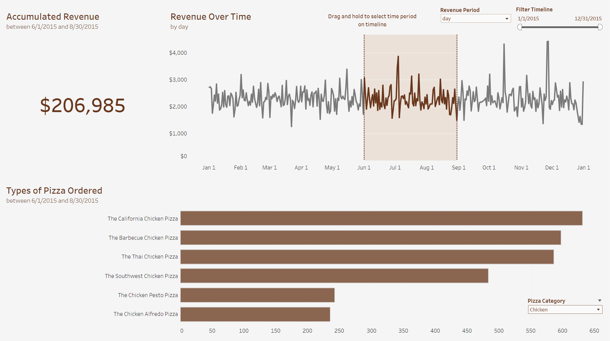

# Plato's Pizza Sales Dashboard

Visualizing a year's worth of sales trends for Plato's Pizza, a Greek-inspired pizza spot based in New Jersey. The Tableau dashboard linked [here](https://public.tableau.com/app/profile/dylan.tran1987/viz/PlatosPizzaDashboard_17041495578260/Dashboard) was designed to improve operations and drive more sales.

## Dataset Description

After preprocessing, the dataset (**combined_pizza_data.xlsx**) contains over 48,000 entries of individual pizzas ordered throughout the year 2015.

- **order_id**: A unique identifier for each order placed.
- **item_id**: A unique identifier for each pizza in an order. Multiple item_id can be associated with the same order_id.
- **pizza_category**: The general category to which the pizza belongs.
- **pizza_name**: The full name of the pizza.
- **pizza_type**: A shorthand version of the pizza name, in lowercase and abbreviated form.
- **pizza_size**: The size of the pizza.
- **quantity**: The number of pizzas of this type and size ordered.
- **total_price**: The selling price for this pizza in the order.
- **combined_time**: The date and time when the order was placed, in the format YYYY-MM-DD HH:MM:SS.

## Insights and Recommendations

### Revenue Overview  

In 2015, Plato's Pizza generated over $800,000 in revenue. Monthly revenue fluctuated between $64,028 and $72,558, with July representing the peak month. Revenue changes from month to month did not exceed 10%. A lack of seasonal turbulence means that operational adjustments should be focused towards specific days and hours, as will be discussed.

### Chronological Trends

An analysis of daily sales patterns reveals that Thursdays, Fridays, and Saturdays are the most rewarding days. Revenue spikes are also observed during holidays such as July 4th, Thanksgiving, and Christmas. Examining the revenue stream during individual days reveals that peak sales hours occur around lunch (12 PM; 1 PM) and dinner (5 PM; 6 PM). Staffing should be adjusted to accomodate and enhance efficiency during the aforementioned days and times.

Sundays see notable declines in revenue. Plato's should consider implementing targeted promotions to incentivize sales and justify the resources invested to operate on that day of the week. Additionally, there is a significant drop in revenue after 10 PM on operational days as a whole. Given the scarcity of business attracted during late-night hours, the business is encouraged to close earlier to minimize costs. Peak days and holidays could be exceptions to this rule and stay open for later, but bottom-line the business should experiment with trimming hours on variable days to conserve resources.

### Product Performance

Several pizzas from the 'Chicken' and 'Classic' categories are particularly popular; six pizzas from these two categories sold over 2,300 units each, including the Barbeque Chicken, Thai Chicken, California Chicken, Classic Deluxe, Hawaiian, and Pepperoni. From the 'Veggie' category, only the Four Cheese pizza stands out, with over 1,900 units sold. From the 'Supreme' category, the Sicilian, Spicy Italian, and Italian Supreme lead the way at over 1,800 units. All other pizzas not mentioned (save for one) sold at least 900 units in the year, regardless the category.

The Brie Carre pizza from the 'Supreme' category is by and large the lowest performer in the business, with sales under 500 units. If any ingredient in this pizza (such as brie, caramelized onions, or herbs) is not used in other pizza offerings, special care should be taken to source it efficiently, as reduced demand can complicate economical purchasing. Plato's can also evaluate whether keeping the Brie Carre pizza on the menu is necessary for the future. As a whole, it is recommended to examine recipes and identify relationships between ingredients used in all 32 pizza types to streamline the sourcing process.

Finally, although not featured in the dashboard, a brief analysis regarding pizza sizing was conducted. 2015 saw sales of 14,137 smalls, 15,385 mediums, 18,526 larges, 544 extra-larges, and 28 double-extra-larges. Notably, only the Greek pizza was ordered in extra-large and double-extra-large sizes, raising questions about whether this is a constraint imposed by Plato's, which suggests a potential area for further investigation.
